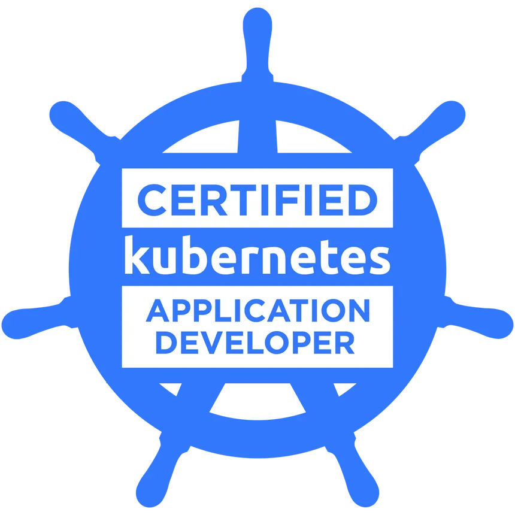

<p align="center"></p>
<h4 align="center"><a href="https://www.cncf.io/certification/ckad/">https://www.cncf.io/certification/ckad/</a></h3>
<h1 align="center">Certified Kubernetes Application Developer (CKAD) Notes</h1>

# CKAD Practice
- https://learn.kodekloud.com/user/courses/udemy-labs-certified-kubernetes-administrator-with-practice-tests

# CKAD Notes

## 1. Core Concepts

### Components
- Master Nodes - Manage, plan, schedule, and monitor nodes
  - Kube-apiserver - API server for Kubernetes cluster
    - etcd - Key-value store for Kubernetes cluster data
    - Kube-Scheduler - Schedules pods to worker nodes based on resource availability and constraints
    - Controller-manager - Runs controllers that manage the state of the cluster
        - Node-controller - Monitors node health and manages node lifecycle
        - Replication-controller - Ensures the desired number of pod replicas are running
- Worker Nodes - Host applications as containers
  - Kubelet (captain of the ship) - Agent that runs on each worker node, responsible for managing pods and containers
  - Kube-proxy - Network proxy that runs on each worker node, responsible for maintaining network rules and load balancing
  - Container Runtime Engine - Software that runs containers (e.g. containerd, rkt and etc.)

### etcd 
- Distributed key-value store that stores all cluster data
- Steps to start etcd:
  1. Download binaries
  2. Extract 
  3. Run etcd server on port 2379
- `etcd client` can be used to interact with the `etcd server` to perform operations like setting and getting key-value pairs
- Deploy multiple etcd servers for high availability
- setup with `kubeadm` - deploys the etcd server as pods in the cluster, managed by the kube-apiserver
  - to list all keys: `kubectl exec etcd-master -n kube-system etcdctl get / --prefix --keys-only`

### kube-apiserver
- with `kubeadm`
  - View apiserver: kubectl get pods -n kube-system`, and look for `kube-apiserver-*` pods
  - view apiserver options: `cat /etc/kubernetes/manifests/kube-apiserver.yaml`
- with non-`kubeadm`
  - view apiserver options
    - `cat /etc/systemd/system/kube-apiserver.service`, or
    - `ps -aux | grep kube-apiserver` to find the process and its options

### kube-controller-manager
- What it does:
  - Watch Status
  - Remediate situations
  - Monitor period: 5s
  - Monitor Grace period: 40s
  - Eviction timeout: 5m
- with `kubeadn`
  - view controller-manager: `kubectl get pods -n kube-system`, and look for `kube-controller-manager-*` pods
  - View options: `cat /etc/kubernetes/manifests/kube-controller-manager.yaml`
- With non-`kubeadm`
  - view controller-manager options
    - `cat /etc/systemd/system/kube-controller-manager.service`, or
    - `ps -aux | grep kube-controller-manager` to find the process and its options

### kube-scheduler
- decides which pod goes where
- with `kubeadm`
  - view scheduler: `kubectl get pods -n kube-system`, and look for `kube-scheduler-*` pods
  - View options: `cat /etc/kubernetes/manifests/kube-scheduler.yaml`
- with non-`kubeadm`
  - view scheduler options
    - `cat /etc/systemd/system/kube-scheduler.service`, or
    - `ps -aux | grep kube-scheduler` to find the process and its options

### kubelet
> [!IMPORTANT]
> kubeadm DOES NOT automatically deploy kubelets
- Always manually install kubelet on each worker node, `wget https://storage.googleapis.com/kubernetes-release/release/v1.13.0/bin/linux/amd64/kubelet`
- View kubelet options
  - `ps -aux | grep kubelet` to find the process and its options

### kube-proxy
- kube-proxy is a process that runs on each node in the cluster
- Everytime a new service is created, kube-proxy updates the iptables rules to route traffic to the appropriate pods
- Every pod can reach other pods, by deploying a pod networking solution e.g. webapp on pod 1 and database on pod 2
- with `kubeadm`
  - it deploys kube-proxy as a DaemonSet, which ensures that there is a kube-proxy pod running on each node in the cluster
  - view kube-proxy: `kubectl get pods -n kube-system`, and look for `kube-proxy-*` pods
  - view daemonset: `kubectl get daemonset -n kube-system`, and look for `kube-proxy` daemonset

### pods
- Smallest deployable unit in Kubernetes
- To scale, we usually don't increase containers in a pod, we increase the number of pods instead

#### multi-container pods (with helpers):
- Sidecar - A helper container that enhances the main container, e.g. log collector, proxy, etc.
- With pods, we don't need to maintain the mapping of which helper container belongs to which main container, because they are all in the same pod and share the same lifecycle

#### Commands
- Deploy a pod: `kubectl run <pod-name> --image=<image-name>`
- View pods: `kubectl get pods`
- Describe pods: `kubectl describe pod <pod-name>`
- Create file below to setup pod configs
```yaml
apiVersion: v1
kind: Pod
metadata: 
  name: myapp-pod
  labels:
    app: myapp
    type: front-end        # <-- can have any kind of key-value pair as we see fit, but we should follow some conventions for better organization and management
spec: 
  containers:
    - name: nginx-container
      image: nginx:latest
```
- create the pod: `kubectl create -f pod-definition.yaml`

## 2. Configuration
### Docker
Layer 1: Base image (e.g. Ubuntu)
Layer 2: Change in apt packages (e.g. install python)
Layer 3: Change in pip packages (e.g. install flask and flask-mysql)
Layer 4: Change in source code (e.g. copy source code to the image)
Layer 5: Update entrypoint

```yaml
FROM Ubuntu

RUN apt-get update 
RUN apt-get install python

RUN pip install flask
RUN pip install flask-mysql

COPY . /opt/source-code

ENTRYPOINT FLASK_APP=/opt/source-code/app.py flask run
```

### Commands and Arguments in Docker
- `docker build -t myapp .`: Build an image named myapp with the latest tag from the current directory
- `docker run -p 8282:8080 myapp`: Run the myapp image with the default command (which is usually bash), 8282 is the port on the host machine, 8080 is the port in the container
- `docker ps -a`: List all containers, including the ones that are stopped
- `docker images`: List all images
- `docker run ubuntu sleep`
- `docker logs -f <container-id>`: Follow the logs of a container
- CMD provides defaults args
```yaml
FROM ubuntu
CMD sleep 5
```
- ENTRYPOINT provides the command to run 
```yaml
FROM ubuntu
ENTRYPOINT["sleep"]
```
  - To set default value
```yaml
FROM ubuntu
ENTRYPOINT["sleep"]
CMD ["5"]
```


### Commands and Arguments in Kubernetes
```yaml
apiVersion: v1
kind: Pod
metadata:
  name: ubuntu-sleeper-pod
spec:
  containers:
    - name: sleeping-container
      image: ubuntu-sleeper
      command: ["sleep"]
      args: ["5"]
```
- The command field overrides the ENTRYPOINT instruction in Docker file,
- The args field overrides the CMD instruction in Docker file
- It's not the command field that overrides the CMD instruction in Docker file

### Environment Variables and ConfigMaps
- In docker, `docker run -e APP_COLOR=blue myapp` to set environment variable
- In Kubernetes, we can set environment variables in the pod definition file
```yaml
apiVersion: v1
kind: Pod
metadata:
  name: app-color-pod
spec:
  containers:
    - name: app-color-container
      image: app-color-sleeper
      ports:
        - containerPort: 8080
      env:
        - name: APP_COLOR
          value: "blue"
```
- We can also use ConfigMaps
```yaml
apiVersion: v1
kind: Pod
metadata:
  name: app-color-pod
spec:
  containers:
    - name: app-color-container
      image: app-color-sleeper
      ports:
        - containerPort: 8080
      env:
        - name: APP_COLOR
          valueFrom:
            configMapKeyRef:
              name: app-color-config
              key: color
      # or
      envFrom:
        - configMapRef:
            name: app-color-config
      # or
  volumes:
    - name: app-color-config-volume
      configMap:
        name: app-color-config
```

#### Command
- Create a ConfigMap imperatively: `kubectl create configmap <config-name> --from-literal=<key>=<value>`
  - Multiple: `kubectl create configmap <config-name> --from-literal=<key1>=<value1> --from-literal=<key2>=<value2>`
  - From file: `kubectl create configmap <config-name> --from-file=<file-path>`
  - From file specify key: `kubectl create configmap <config-name> --from-file=<key>.<props>=<file-path>`
- View ConfigMaps: `kubectl get configmaps`
- Describe ConfigMap: `kubectl describe configmap <config-name>`
- Create a ConfigMap declaratively: `kubectl create -f`
```yaml
apiVersion: v1
kind: ConfigMap
metadata: 
  name: app-color-config
data:
  APP_COLOR: "blue"
  APP_MODE: "production"
```

### Secrets
- Create secret, then inject into pod

#### Command
- Create a Secret
  - Imperatively:
    - `kubectl create secret generic <secret-name> --from-literal=<key>=<value>`
    - Multiple: `kubectl create secret generic <secret-name> --from-literal=<key1>=<value1> --from-literal=<key2>=<value2>`
    - From file: `kubectl create secret generic <secret-name> --from-file=<file-path>`
  - Declaratively:
    - kubectl create -f 
    - Best if to store secret in hash form, which can be generated with `echo -n 'myvalue' | base64`
```yaml
apiVersion: v1
kind: Secret
metadata:
    name: app-secret
type: Opaque
stringData:
  DB_host: bXlzcWwtc2VydmVyLmV4YW1wbGUuY29t
  DB_user: bXl1c2Vy
  DB_password: bXlwYXNzd29yZA==
```
- Get secrets: `kubectl get secrets`
- Describe secrets: `kubectl describe secret <secret-name
- Decoding secret: `echo -n 'bXl1c2Vy' | base64 --decode`
- To inject secrets into pod```yaml
```yaml
apiVersion: v1
kind: Pod
metadata:
    name: app-secret-pod
spec:
    containers:
    - name: app-secret-container
      image: app-secret-sleeper
      envFrom:
      - secretRef:
          name: app-secret
      # or
      env:
      - name: DB_host
        valueFrom:
          secretKeyRef:
            name: app-secret
            key: DB_host
```

#### Encrypting secret data at rest
- Stored in etcd
- https://kubernetes.io/docs/tasks/administer-cluster/encrypt-data/#:~:text=control%20plane%20host.-,Verify%20that%20newly%20written%20data%20is%20encrypted,-Data%20is%20encrypted

### Security Contexts
- If both pod and container, settings on container level will override the settings on pod level
```yaml
apiVersion: v1
kind: Pod
metadata:
    name: security-context-pod
spec:
  containers:
    - name: security-context-container
      image: security-context-sleeper
      securityContext:
        runAsUser: 1000
        capabilities:
          add: ["NET_ADMIN", "SYS_TIME"] # Container-level only, not supported at pod level
```

#### Command
- Check user that is running the container: `kubectl exec <pod-name> -- whoami`

### Resource Requirements
- kube-scheduler checks resources before scheduling a pod to a node
- CPU cannot use resources more than its limit, but Memory can use more than its limit (but will get OOM killed if constantly)
- By default, no resource limit are set. A pod can use all the resources of a node, which can lead to resource contention and instability in the cluster.

#### CPU behavior
- No request, no limit: pod can use all CPU on the node, but is only guaranteed a minimal fair share if multiple pods compete. CPU can be throttled during contention.
- No request, limit: pod can use all the CPU resources of the node, but it will be throttled if it tries to use more than its limit
- Request, limit: pod is guaranteed to have the requested CPU resources, but it will be throttled if it tries to use more than its limit
- Request, no limit: pod is guaranteed to have the requested CPU resources, but it can use all the CPU resources of the node if needed, which can lead to resource contention and instability in the cluster

#### Memory
- No request, no limit: Pod can use all memory on the node; may cause resource contention and instability if multiple pods use lots of memory.
- No request, limit: Pod can use memory freely until it hits the limit; it will be OOMKilled if it tries to exceed the limit.
- Request, limit: Pod is guaranteed the requested memory; will be OOMKilled if it exceeds the limit.
- Request, no limit: Pod is guaranteed the requested memory, but can use more if available; Kubernetes cannot throttle memory, so pod may still be OOMKilled if node runs out of memory.

#### Limit range

```yaml
apiVersion: v1
kind: LimitRange
metadata:
  name: cpu-resource-constraints
spec:
  limits:
  - type: Container
    default:
      cpu: 500m               # or memory: 512Mi
    defaultRequest:
      cpu: 200m                # or memory: 512Mi
    max:
      cpu: "1"
    min:
      cpu: 100m
```

### Service Accounts
- Two types of accounts
  - User accounts, used by humans (admins, dev)
  - Service accounts, used by machines (apps, prometheus, jenkins, etc.)
- After v1.24, token is no longer automatically created for service accounts, we need to create a token secret and link it to the service account manually (has expiry date, 1h by default)


#### Command
- Create a service account: `kubectl create serviceaccount <service-account-name>`
- View service accounts: `kubectl get serviceaccounts`
- Describe service account: `kubectl describe serviceaccount <service-account-name>`, token stored as secret
- Describe secret: `kubectl describe secret <secret-name>`, use token to access
- Create token secret: `kubectl create token <service-account-name>`, this will automatically create a secret and link it to the service account
- 


### Taint and Tolerations
- Node: Taints, no unwanted pods to be scheduled on the node
- Pods: Tolerations, allow pods to be scheduled on nodes with matching taints
- Taints and tolerations work together to ensure that pods are not scheduled onto inappropriate nodes.
- Taint and Toleration doesn't tell where the pods should be scheduled, it only tells where the pods should not be scheduled.
- If a node has a taint, it means that no pods can be scheduled on that node unless they have a matching toleration. If a pod has a toleration, it means that it can be scheduled on nodes with matching taints.

#### Command
- Taint a node: `kubectl taint nodes <node-name> <key>=<value>:<taint-effect>`, taint-effect can be NoSchedule, PreferNoSchedule, or NoExecute
  - NoExecute: Taints the node so that no pods can be scheduled on it, and any existing pods on the node will be evicted, unless pod has matching teleration
  - NoSchedule: Taints the node so that no pods can be scheduled on it, but existing pods will not be evicted
  - PreferNoSchedule: Taints the node so that the scheduler will try to avoid schedulin
- Untaint a node, append dash: `kubectl taint nodes <node-name> <key>:<taint-effect>-`
- Add toleration is below
```yaml
apiVersion: v1
kind: Pod
metadata:
  name: myapp-pod
spec:
  containers:
    - name: nginx-container
      image: nginx
  tolerations:
  - key: "app"
    operator: "Equal"
    value: "blue"
    effect: "NoSchedule"
```

### Node Selectors
- Allows us to say which nodes we want to schedule our pods on

#### Command
- Add label to a node: `kubectl label nodes <node-name> <key>=<value>`
- More complex with Node Affinity
```yaml
apiVersion: v1
kind: Pod
metadata:
  name: myapp-pod
spec:
  containers:
    - name: data-processor
      image: data-processor
  nodeSelector:
    size: large
```

### Node Affinity
- More advance expression of node selector, allows us to specify rules for scheduling pods on nodes based on labels and conditions
- Below works the same as above
```yaml
apiVersion: v1
kind: Pod
metadata:
  name: myapp-pod
spec:
  containers:
    - name: data-processor
      image: data-processor
  affinity:
    nodeAffinity:
      requiredDuringSchedulingIgnoredDuringExecution: 
        nodeSelectorTerms:
        - matchExpressions:
          - key: size
            operator: In                  # operator can be In, NotIn, Exists, DoesNotExist, Gt, Lt
            values:
            - large
```

#### Affinity types
- RequiredDuringSchedulingIgnoredDuringExecution: If the rules are not met, the pod will not be scheduled. If the rules are violated after the pod is scheduled, it will not be evicted.
- PreferredDuringSchedulingIgnoredDuringExecution: if the rules are not met, the pod will still be scheduled, but it will be less preferred. If the rules are violated after the pod is scheduled, it will not be evicted.
- RequiredDuringSchedulingRequiredDuringExecution: If the rules are not met, the pod will not be scheduled. If the rules are violated after the pod is scheduled, it will be evicted.

### Affinity vs Taint & Tolerations
- Taints and tolerations does not tell where the pods should be scheduled, it only tells where the pods should not be scheduled.
- Affinity tells where the pods should be scheduled, however, it does not guarantee that other pods will not be scheduled on the same node
- Combination of both can be used to achieve more complex scheduling requirements
  - TnT to prevent other pods form being placed on our nodes
  - Affinity to specify where our pods should be placed, and prevent our pods from being placed on other nodes

## 2.5. Multi-container Pods
- Create multicontainer pod (co-located containers pattern)
```yaml
apiVersion: v1
kind: Pod
metadata:
  name: simple-webapp
  labels:
    app: simple-webapp
spec:
  containers:
    - name: web-app
      image: simple-webapp:latest
      ports:
      - containerPort: 8080
    - name: main-app
      image: main-app
```

### Design patterns
- Co-located Containers: Two containers running in a pod, used when 2 services dependent on each other, e.g. web server and app 
- Regular Init Container: A container that runs before the main container, used for initialization tasks, e.g. database migration, configuration setup, etc.
```yaml
apiVersion: v1
kind: Pod
metadata:
  name: simple-webapp
  labels:
    app: simple-webapp
spec:
  containers:
    - name: web-app
      image: simple-webapp:latest
      ports:
      - containerPort: 8080
  initContainers:
  - name: main-app
    image: busybox
    command: 'wait-for-it.sh db'
```
- Sidecar Containers: A container that runs alongside the main container, used for enhancing the main container, e.g. log collector, proxy, etc.
```yaml
apiVersion: v1
kind: Pod
metadata:
  name: simple-webapp
  labels:
    app: simple-webapp
spec:
  containers:
    - name: web-app
      image: simple-webapp:latest
      ports:
      - containerPort: 8080
  initContainers:
  - name: main-app
    image: busybox
    command: 'wait-for-it.sh db'
    restartPolicy: Always
```

## 3. Observability
## 4. Pod Design
## 5. Services & Networking
## 6. State Persistence
## 7. Security
## 8. Helm Fundamentals
## 9. Kustomize Fundamentals


## 9. Exam Tips & Speed Tricks

### Aliases
```bashrc
# --- Core ---
alias k='kubectl'
alias kg='kubectl get'
alias kd='kubectl describe'
alias krm='kubectl delete'

# --- Apply / Create ---
alias ka='kubectl apply -f'
alias kcf='kubectl create -f'
alias kc='kubectl create'
alias kr='kubectl run'

# --- Logs / Exec ---
alias kl='kubectl logs'
alias ke='kubectl exec -it'

# --- Namespaces ---
alias kn='kubectl config set-context --current --namespace'

# --- YAML generation ---
export do='--dry-run=client -o yaml'
```

### Command Tips
- Create NGINX pod: `kubectl run nginx --image=nginx`
- Dry run to generate pod YAML: `kubectl run nginx --image=nginx --dry-run=client -o yaml`
- Crete deployment: `kubectl create deployment nginx --image=nginx`
- Dry run to generate deployment YAML and save: `kubectl create deployment nginx --image=nginx --dry-run=client -o yaml > nginx-deployment.yaml`
- Make changes to the YAML file and create: `kubectl create -f nginx-deployment.yaml`

### Imperative Command Tips
- `--dry-run`: By default as soon as the command is run, the resource will be created. 
- `--dry-run=client` If you simply want to test your command . This will not create the resource, instead, tell you whether the resource can be created and if your command is right.
- `-o yaml`: This will output the resource definition in YAML format on screen
- `kubectl api-resources | grep -E 'nodes|pods|services|deployments'` to list all the resources we can create with kubectl

#### Pod
- `kubectl run nginx --image=nginx`
-  `kubectl run redis -l tier=db --image=redis:alpine`, with label `tier=db`
- `kubectl run nginx --image=nginx --dry-run=client -o yaml`, 

#### Deployment
- `kubectl create deployment --image=nginx nginx`
- `kubectl create deployment --image=nginx nginx --dry-run=client -o yaml`
- `kubectl create deployment nginx --image=nginx --replicas=4`
- `kubectl scale deployment nginx --replicas=4`
- `kubectl create deployment nginx --image=nginx --dry-run=client -o yaml > nginx-deployment.yaml`, save file and modify

#### Service
Create a Service named redis-service of type ClusterIP to expose pod redis on port 6379
- `kubectl expose pod redis  --type=ClusterIP --port=6379 --name redis-service --dry-run=client -o yaml` (This will automatically use the pod's labels as selectors)
- `kubectl create service clusterip redis --tcp=6379:6379 --dry-run=client -o yaml` (This will not use the pods labels as selectors, instead it will assume selectors as app=redis)
Create a Service named nginx of type NodePort to expose pod nginx's port 80 on port 30080 on the nodes:
- `kubectl expose pod nginx --type=NodePort --port=80 --name=nginx-service --dry-run=client -o yaml` (This will automatically use the pod's labels as selectors, but you cannot specify the node port. You have to generate a definition file and then add the node port in manually before creating the service with the pod.)
- `kubectl create service nodeport nginx --tcp=80:80 --node-port=30080 --dry-run=client -o yaml` (This will not use the pods labels as selectors)


